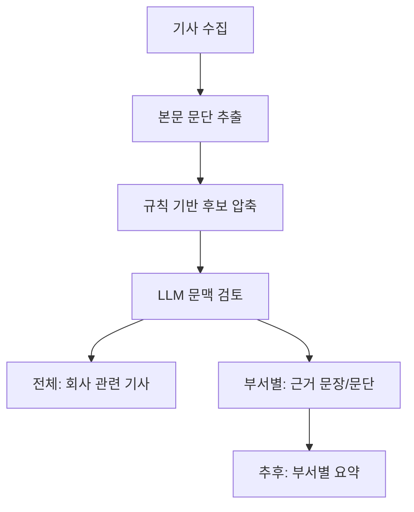

# LLM 도입 설계

이 프로젝트의 LLM 역할은 “기사를 새로 쓰는 것”이 아니라, 매일 수집된 기사에서 한국석유공사 업무와 관련 있는 기사와 근거 문장/문단을 고르는 것입니다.

## 권장 기본값

GitHub Actions 자동 실행 기준으로는 `github-models`를 기본 provider로 둡니다.

- 별도 외부 API 키 없이 Actions의 `GITHUB_TOKEN`을 사용할 수 있습니다.
- workflow에 `permissions: models: read`가 필요합니다.
- Llama 계열 모델을 `LLM_MODEL` 값만 바꿔 교체할 수 있습니다.
- 무료 사용량과 rate limit이 있으므로 모든 기사를 LLM에 넣지 않고, 규칙 기반 후보를 먼저 좁힌 뒤 batch로 검토합니다.

기본 환경변수:

```text
LLM_PROVIDER=github-models
LLM_MODEL=meta/meta-llama-3.1-8b-instruct
LLM_MAX_ARTICLES=80
LLM_BATCH_SIZE=8
```

## Provider 후보

| Provider | 장점 | 단점 | 자동화 적합도 |
| --- | --- | --- | --- |
| GitHub Models | Actions에서 `GITHUB_TOKEN` 사용 가능, Llama 모델 선택 가능 | GitHub Models 사용 가능 여부와 무료 rate limit 확인 필요 | 높음 |
| Groq | Llama API가 빠르고 OpenAI 호환 형식 | `GROQ_API_KEY` secret 필요, 무료 한도 변동 가능 | 높음 |
| Hugging Face Inference Providers | 다양한 오픈 모델 접근 가능 | 무료 credit이 작고 과금 전환 구조가 있어 운영 예측이 약함 | 중간 |
| Ollama | 모델 자체 비용 없음, 로컬에서 완전 통제 | GitHub-hosted runner에서 모델 다운로드와 CPU 추론이 무거움 | 낮음 |
| rule | 비용·토큰·외부 의존성 없음 | 문맥 판단이 약함 | fallback |

## 분석 파이프라인



## LLM 입출력 계약

LLM에는 기사 묶음과 22개 부서의 역할·키워드를 JSON으로 전달합니다. 응답도 JSON만 받습니다.

```json
{
  "results": [
    {
      "article_id": "article id",
      "company_relevant": true,
      "company_reason": "한국석유공사 관점에서 봐야 하는 이유",
      "departments": [
        {
          "department_id": "stockpiling",
          "score": 0.86,
          "evidence_text": "근거 문장 또는 문단",
          "evidence_type": "paragraph",
          "reason": "석유비축처 업무와 연결되는 이유"
        }
      ]
    }
  ]
}
```

## 교체 방식

모델 교체는 코드 수정 없이 환경변수로 처리합니다.

```text
LLM_PROVIDER=groq
LLM_MODEL=llama-3.3-70b-versatile
GROQ_API_KEY=...
```

또는 로컬 실험:

```text
LLM_PROVIDER=ollama
LLM_MODEL=llama3.1:8b
OLLAMA_BASE_URL=http://localhost:11434/v1
```

## 참고한 공식 문서

- GitHub Models Quickstart: https://docs.github.com/en/github-models/quickstart
- GitHub Models REST API: https://docs.github.com/en/rest/models/inference
- GitHub Models AI SDK model id 예시: https://github.com/github/models-ai-sdk
- Groq API Reference: https://console.groq.com/docs/api-reference
- Hugging Face Inference Providers: https://huggingface.co/docs/hub/en/models-inference
- Hugging Face pricing: https://huggingface.co/docs/inference-providers/en/pricing
