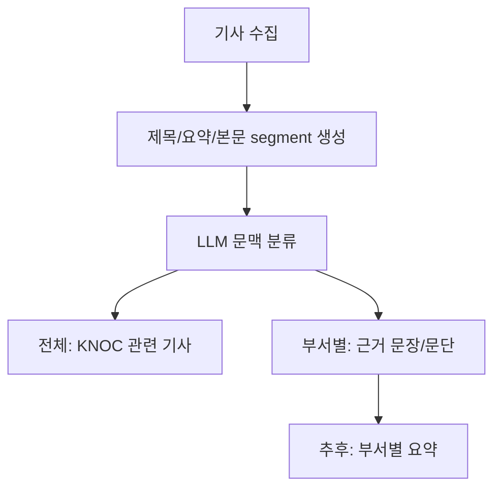

# LLM 도입 설계

이 프로젝트의 LLM 역할은 매일 수집된 기사에서 한국석유공사 관점의 관련 기사와 부서별 근거 문장/문단을 분류하는 것입니다.

## 기본 provider

GitHub Actions 자동 실행 기준으로는 `github-models`를 기본 provider로 둡니다.

- Actions의 `GITHUB_TOKEN`을 사용할 수 있습니다.
- workflow에 `permissions: models: read`가 필요합니다.
- 모델은 `LLM_MODEL` 값으로 교체합니다.
- 기본값은 `meta/meta-llama-3.1-8b-instruct`입니다.

2026-06-04 로컬 토큰으로 직접 확인한 결과, 현재 토큰은 이 모델에 `No access` 응답을 받았습니다. GitHub Models에서 해당 모델 사용 권한을 활성화하거나, repo variable `LLM_MODEL`에 접근 가능한 모델명을 넣어야 실제 자동 분류가 수행됩니다.

기본 환경변수:

```text
LLM_PROVIDER=github-models
LLM_MODEL=meta/meta-llama-3.1-8b-instruct
LLM_MAX_ARTICLES=0
LLM_BATCH_SIZE=5
```

`LLM_MAX_ARTICLES=0`은 수집된 전체 기사를 LLM에 보낸다는 뜻입니다. 무료 모델 한도나 rate limit이 걸리면 `llm_review.status`가 `partial` 또는 `error`로 남습니다.

## Provider 후보

| Provider | 장점 | 단점 | 자동화 적합도 |
| --- | --- | --- | --- |
| GitHub Models | Actions에서 `GITHUB_TOKEN` 사용 가능, Llama 모델 선택 가능 | GitHub Models 사용 가능 여부와 무료 rate limit 확인 필요 | 높음 |
| Groq | Llama API가 빠르고 OpenAI 호환 형식 | `GROQ_API_KEY` secret 필요, 무료 한도 변동 가능 | 높음 |
| Hugging Face Inference Providers | 다양한 오픈 모델 접근 가능 | 무료 credit이 작고 과금 전환 구조가 있어 운영 예측이 약함 | 중간 |
| Ollama | 모델 자체 비용 없음, 로컬에서 완전 통제 | GitHub-hosted runner에서 모델 다운로드와 CPU 추론이 무거움 | 낮음 |

## 분석 파이프라인



## LLM 입출력 계약

LLM에는 기사 묶음, 한국석유공사 역할, 22개 부서의 역할을 JSON으로 전달합니다. 응답도 JSON만 받습니다.

```json
{
  "results": [
    {
      "article_id": "article id",
      "company_relevant": true,
      "company_reason": "한국석유공사 관점에서 봐야 하는 이유",
      "departments": [
        {
          "department_id": "stockpiling",
          "relevance_score": 0.86,
          "evidence_segment_ids": ["s3"],
          "evidence_text": "근거 문장 또는 문단",
          "evidence_type": "paragraph",
          "reason": "석유비축처 업무와 연결되는 이유"
        }
      ]
    }
  ]
}
```

## 참고한 공식 문서

- GitHub Models Quickstart: https://docs.github.com/en/github-models/quickstart
- GitHub Models REST API: https://docs.github.com/en/rest/models/inference
- GitHub Models AI SDK model id 예시: https://github.com/github/models-ai-sdk
- Groq API Reference: https://console.groq.com/docs/api-reference
- Hugging Face Inference Providers: https://huggingface.co/docs/hub/en/models-inference
- Hugging Face pricing: https://huggingface.co/docs/inference-providers/en/pricing
